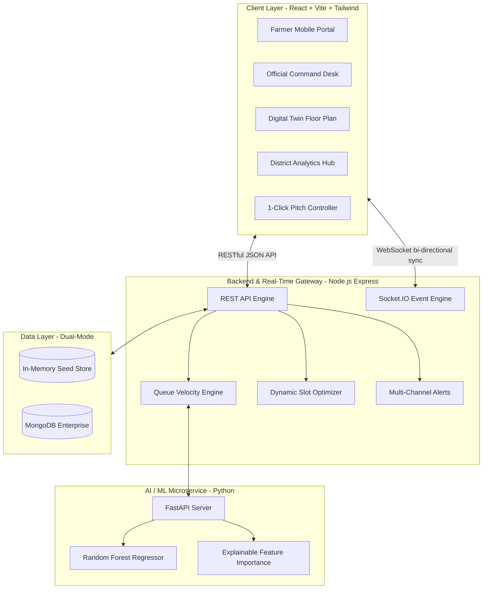

# AgriFlow – Smart Procurement Queue & Status Tracking Platform
### Smart India Hackathon 2026 | Problem Statement: PS 26032
**Department of Consumer Affairs (DoCA), Ministry of Consumer Affairs, Food & Public Distribution**

[](https://sih.gov.in)
[](https://consumeraffairs.nic.in)
[](https://socket.io)
[](https://fastapi.tiangolo.com)
[](LICENSE)

---

## 1. Executive Summary & Problem Overview
Every harvesting season, millions of Indian farmers bring their produce (Wheat, Paddy, Pulses, Oilseeds) to government procurement centres and APMC Mandis. However, they face:
- **Excessive Physical Waiting Times** (frequently 4 to 8+ hours in extreme weather).
- **Zero Real-Time Visibility** on live queue velocity or counter status.
- **Sudden Mandi Yard Congestion** causing vehicle blockages and logistics breakdowns.
- **Lack of Transparency** in quality inspection, moisture grading, and payment settlement.

---

## 2. The AgriFlow Vision & Innovation
> **"THE QUEUE COMES TO THE FARMER."**

AgriFlow is **not just another static slot-booking application**. AgriFlow treats the mandi as a dynamic cyber-physical system:

```
PHYSICAL QUEUE ➔ DIGITAL QUEUE ➔ REAL-TIME QUEUE ➔ PREDICTIVE QUEUE ➔ OPTIMIZED QUEUE
```

Instead of simply telling a farmer:
> *"Your token is A-127."*

AgriFlow delivers **Actionable Queue Intelligence**:
> *"Your token is A-127. 6 farmers are ahead of you across 4 active counters. Current queue velocity is 0.69 tokens/min. Predicted wait time is 18 mins. Recommended arrival time at Mandi Gate is 10:42 AM. Yard congestion is LOW."*

---

## 3. System Architecture



---

## 4. Key Differentiators & Features

| Feature | Traditional Mandi System | AgriFlow Real-Time Platform |
| :--- | :--- | :--- |
| **Slot Booking** | Static time slot (fails on delays) | **Smart Dynamic Slot Allocation** with congestion prediction |
| **Queue Tracking** | Paper token or manual board | **Live WebSocket Radar** with real-time countdown |
| **Wait-Time Prediction** | None (unpredictable) | **Explainable AI Regression** (Crop, Counter, Rush factors) |
| **Yard Congestion** | Uncontrolled traffic jams | **Autonomous Slot Rebalancing** (flattens peak load from 86% to 61%) |
| **Quality & Weighing** | Opaque manual registers | **Digital FAQ Inspection Certificate** with moisture check |
| **Payment Tracking** | Uncertain bank credit dates | **Live DBT / PFMS Payout Timeline** |

---

## 5. Technology Stack

- **Frontend:** React 18, Vite, Tailwind CSS, Lucide Icons, Recharts, Canvas Confetti, QRCode.react
- **Backend:** Node.js, Express.js, Socket.IO, Mongoose, Morgan
- **AI / ML Microservice:** Python 3.14, FastAPI, Scikit-Learn, Pandas, NumPy, Joblib
- **Persistence:** Dual-Mode Data Engine (Instant In-Memory Store + MongoDB Atlas integration)
- **Internationalization:** English, हिंदी (Hindi), मराठी (Marathi)

---

## 6. Installation & Quickstart

### Prerequisites
- Node.js (v18+)
- Python (v3.10+)

### 1. Clone the Repository
```bash
git clone https://github.com/your-username/AgriFlow.git
cd AgriFlow
```

### 2. Install Dependencies
```bash
# Install server dependencies
cd server
npm install

# Install client dependencies
cd ../client
npm install
```

### 3. Run Backend & Frontend Concurrently
In Terminal 1 (Backend):
```bash
cd server
npm start
# Running on http://localhost:5000
```

In Terminal 2 (Frontend):
```bash
cd client
npm run dev
# Running on http://localhost:5173
```

---

## 7. SIH Hero Demonstration Walkthrough

Click **Hero Pitch** in the top navigation bar or use the floating **SIH Demo Bar** at the bottom:
1. **Baseline State:** View Hero Farmer `A-127` (18 people ahead, ETA 32 mins, Recommended arrival: 10:42 AM).
2. **Real-Time Clearance:** Click *"Complete Token A-109"* on the Officer Desk $\rightarrow$ watch the Farmer radar update to 17 people ahead and ETA 29 mins in $< 15\text{ms}$ without reloading.
3. **Simulate Congestion:** Click *"Simulate Rush Spike"* $\rightarrow$ AI detects surge and raises alert.
4. **Dynamic Optimization:** Click *"Apply Slot Optimization"* $\rightarrow$ peak load drops from 86% to 61%.
5. **Counter 5 Activated:** Click *"Activate Counter 5"* $\rightarrow$ ETA drops to 19 mins, arrival changes to 10:38 AM with voice announcement!

---

## 8. Government Integration Roadmap
- **PFMS (Public Financial Management System):** Automated DBT payout clearing.
- **e-NAM Integration:** Direct linkage with National Agriculture Market trade data.
- **Bluetooth IoT Weighbridges:** Direct capture of gross and tare truck weight.
- **Agmarknet & CACP:** Live MSP rate synchronization.

---

## 9. Team & Contributors
Built with ❤️ for **Smart India Hackathon 2026** (Department of Consumer Affairs, DoCA).
