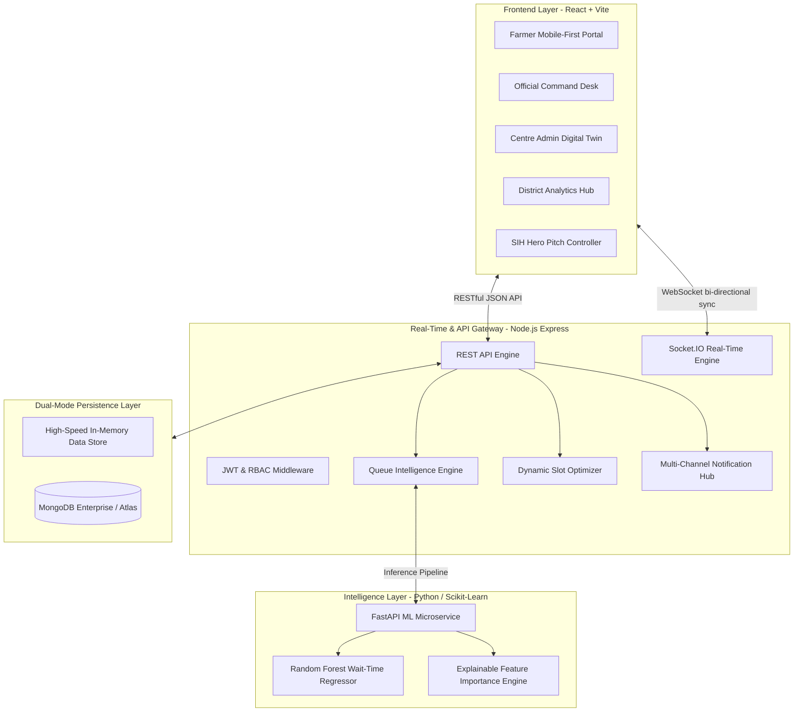

# AgriFlow System Architecture
## SIH 2026 Problem Statement PS 26032 (DoCA)

AgriFlow converts traditional static slot booking into a **Cyber-Physical Real-Time Queue Intelligence Platform**.

---

## 1. High-Level Architecture Overview

---

## 2. Real-Time WebSocket Synchronization Protocol

When an officer completes or calls a token:
1. `token:complete` event is emitted by Officer Desk.
2. Server executes atomic queue advancement:
   - Sets Token status to `COMPLETED`.
   - Decrements `peopleAhead` for all subsequent waiting tokens.
   - Recalculates dynamic ETA ($\text{ETA} = \frac{\text{People Ahead} \times \text{Average Time}}{N_{\text{active}}}$).
3. Server broadcasts `queue:update` and `eta:update` to specific rooms (`centre:PC-PUNE-01` and `farmer:A-127`).
4. Connected Farmer client updates live radar, countdown, and audio chime with $< 15\text{ms}$ latency without browser reload.

---

## 3. Privacy by Design & Security
- Zero biometric/facial data stored.
- Anonymized analytics tokens (`A-127`, `FMR-1002`).
- Signed QR codes with sha256 checksum validation.
- Role-Based Access Control (RBAC) enforced via JWT authentication on API endpoints and WebSocket handshakes. Passwords are salted and hashed using bcrypt.
